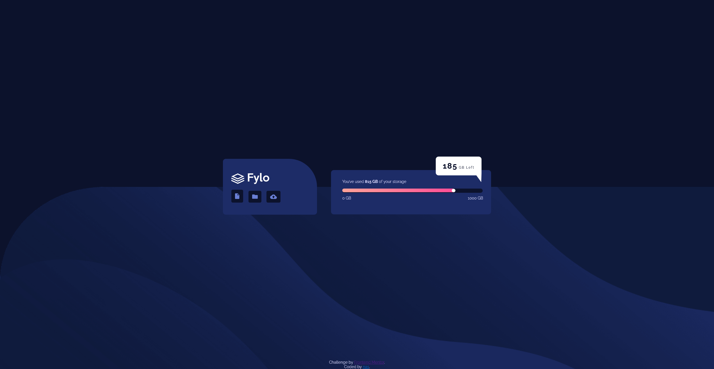
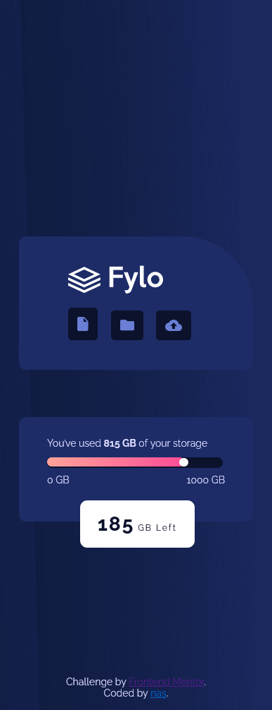

# Frontend Mentor - Fylo data storage component solution

This is a solution to the [Fylo data storage component challenge on Frontend Mentor](https://www.frontendmentor.io/challenges/fylo-data-storage-component-1dZPRbV5n). Frontend Mentor challenges help you improve your coding skills by building realistic projects. 

## Table of contents

- [Overview](#overview)
  - [The challenge](#the-challenge)
  - [Screenshot](#screenshot)
  - [Links](#links)
- [My process](#my-process)
  - [Built with](#built-with)
  - [What I learned](#what-i-learned)
  - [Continued development](#continued-development)
  
- [Author](#author)


## Overview

### The challenge

Users should be able to:

- View the optimal layout for the site depending on their device's screen size

### Screenshot




### Links

- Solution URL: [Github](./index.html)
- Live Site URL: [Live](https://your-live-site-url.com)

## My process

### Built with

- Semantic HTML5 markup
- CSS custom properties
- Flexbox


### What I learned

learned about pseudo classes and how to create a shape basicly


```css
.usage2:before {
    content: "";
    width: 0px;
    height: 0px;
    position: absolute;
    border-left: 24px solid transparent;
    border-right: 1px solid transparent;
    border-top: 33px solid #fff;
    border-bottom: 0px solid #fff;
    left: 137.578px;
    bottom: -24px;
}
```

### Continued development

more to know about pseudo classes

## Author

- Frontend Mentor - [@nas22663](https://www.frontendmentor.io/profile/nas22663)
